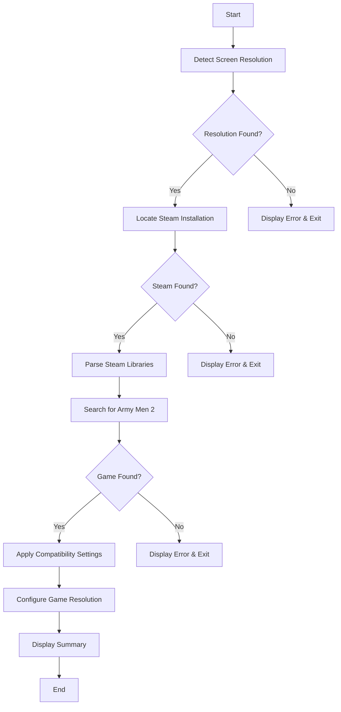

# Design Document

## Overview

This design describes a PowerShell script that automates the configuration of Army Men 2 (Steam version) for Windows 11 compatibility. The script follows a sequential workflow: detect screen resolution, locate the game via Steam, apply compatibility registry settings, and configure game-specific settings. The design emphasizes robust error handling and clear user feedback throughout the process.

## Architecture

The script follows a linear pipeline architecture with distinct phases:



## Components and Interfaces

### 1. Resolution Detector Module

**Purpose:** Retrieves the primary monitor's screen resolution using Windows APIs.

**Interface:**
```powershell
function Get-ScreenResolution {
    # Returns: PSCustomObject with Width and Height properties
    # Throws: Exception if resolution cannot be determined
}
```

**Implementation Approach:**
- Uses `[System.Windows.Forms.Screen]::PrimaryScreen.Bounds` to get resolution
- Falls back to WMI query `Win32_VideoController` if Forms assembly unavailable

### 2. Steam Locator Module

**Purpose:** Finds Steam installation and parses library folders.

**Interface:**
```powershell
function Get-SteamInstallPath {
    # Returns: String path to Steam installation
    # Throws: Exception if Steam not found in registry
}

function Get-SteamLibraryFolders {
    param([string]$SteamPath)
    # Returns: Array of library folder paths
    # Throws: Exception if libraryfolders.vdf cannot be parsed
}
```

**Implementation Approach:**
- Reads `HKLM:\SOFTWARE\WOW6432Node\Valve\Steam` or `HKLM:\SOFTWARE\Valve\Steam` for install path
- Parses `steamapps/libraryfolders.vdf` using regex to extract paths

### 3. Game Finder Module

**Purpose:** Searches Steam libraries for Army Men 2 installation.

**Interface:**
```powershell
function Find-ArmyMen2Installation {
    param([string[]]$LibraryFolders)
    # Returns: String path to Army Men 2 installation directory
    # Throws: Exception if game not found
}
```

**Implementation Approach:**
- Searches for `appmanifest_299220.acf` in each library's steamapps folder
- Extracts install directory from manifest file
- Constructs full path to game executable

### 4. Compatibility Configurator Module

**Purpose:** Applies Windows compatibility settings via registry.

**Interface:**
```powershell
function Set-CompatibilitySettings {
    param([string]$ExecutablePath)
    # Returns: PSCustomObject with applied settings summary
    # Throws: Exception if registry write fails
}
```

**Implementation Approach:**
- Writes to `HKCU:\SOFTWARE\Microsoft\Windows NT\CurrentVersion\AppCompatFlags\Layers`
- Applies flags: `~ WINXPSP3 RUNASADMIN DISABLEDXMAXIMIZEDWINDOWEDMODE 16BITCOLOR`

### 5. Game Configurator Module

**Purpose:** Writes resolution settings to game configuration.

**Interface:**
```powershell
function Set-GameResolution {
    param(
        [string]$GamePath,
        [int]$Width,
        [int]$Height
    )
    # Returns: Boolean indicating success
    # Throws: Exception if config file cannot be written
}
```

**Implementation Approach:**
- Locates or creates configuration file in game directory or user AppData
- Writes resolution values in game's expected format

### 6. Output Handler Module

**Purpose:** Provides consistent user feedback and logging.

**Interface:**
```powershell
function Write-Status {
    param([string]$Message, [string]$Type) # Type: Info, Success, Warning, Error
}

function Write-Summary {
    param([hashtable]$Results)
}
```

## Data Models

### Configuration State Object
```powershell
$ConfigState = @{
    Resolution = @{
        Width = 0
        Height = 0
    }
    SteamPath = ""
    LibraryFolders = @()
    GamePath = ""
    ExecutablePath = ""
    CompatibilityFlags = ""
    ConfigFilePath = ""
    Errors = @()
    Success = $false
}
```

### Steam Library Folder VDF Structure
The `libraryfolders.vdf` file uses Valve's KeyValues format:
```
"libraryfolders"
{
    "0"
    {
        "path"    "C:\\Program Files (x86)\\Steam"
        "apps"
        {
            "299220"    "123456789"
        }
    }
}
```

### App Manifest Structure
The `appmanifest_299220.acf` file contains:
```
"AppState"
{
    "appid"    "299220"
    "installdir"    "Army Men II"
}
```


## Correctness Properties

*A property is a characteristic or behavior that should hold true across all valid executions of a system-essentially, a formal statement about what the system should do. Properties serve as the bridge between human-readable specifications and machine-verifiable correctness guarantees.*

### Property 1: Resolution values are valid positive integers

*For any* successful resolution detection, the returned width and height values SHALL be positive integers within the valid monitor resolution range (1 to 7680 for width, 1 to 4320 for height).

**Validates: Requirements 1.1, 1.2**

### Property 2: VDF parsing extracts all library paths

*For any* valid libraryfolders.vdf content containing N library entries with path values, parsing SHALL return exactly N path strings, each matching the corresponding path value from the VDF.

**Validates: Requirements 2.2**

### Property 3: Game search finds manifest when present

*For any* set of library folder paths where exactly one folder contains `appmanifest_299220.acf`, the search function SHALL return the game installation path from that library.

**Validates: Requirements 2.3, 2.5**

### Property 4: All compatibility flags are correctly applied

*For any* valid executable path, after applying compatibility settings, the registry value SHALL contain all required flags: WINXPSP3, RUNASADMIN, DISABLEDXMAXIMIZEDWINDOWEDMODE, and 16BITCOLOR.

**Validates: Requirements 3.1, 3.2, 3.3, 3.4**

### Property 5: Configuration round-trip preserves resolution

*For any* valid resolution values (width, height), writing them to the game configuration and then reading them back SHALL return the same values.

**Validates: Requirements 4.2**

### Property 6: Status messages generated for each phase

*For any* script execution, status messages SHALL be generated for each of the major phases: resolution detection, Steam location, game search, compatibility settings, and game configuration.

**Validates: Requirements 5.1, 5.4**

## Error Handling

### Resolution Detection Errors
- **Scenario:** Windows Forms assembly not available
- **Handling:** Fall back to WMI query; if both fail, display error and exit with code 1
- **Message:** "Failed to detect screen resolution. Please ensure display drivers are installed."

### Steam Not Found Errors
- **Scenario:** Steam registry key does not exist
- **Handling:** Check both 32-bit and 64-bit registry paths; if neither exists, display error and exit
- **Message:** "Steam installation not found. Please ensure Steam is installed."

### VDF Parsing Errors
- **Scenario:** libraryfolders.vdf is malformed or missing
- **Handling:** Display error with file path; suggest reinstalling Steam
- **Message:** "Could not parse Steam library configuration at {path}."

### Game Not Found Errors
- **Scenario:** Army Men 2 not installed in any Steam library
- **Handling:** List searched paths; suggest installing the game via Steam
- **Message:** "Army Men 2 (App ID 299220) not found. Searched libraries: {paths}"

### Registry Write Errors
- **Scenario:** Insufficient permissions to write compatibility settings
- **Handling:** Display specific error; suggest running as administrator
- **Message:** "Failed to apply compatibility settings: {error}. Try running as Administrator."

### Config File Errors
- **Scenario:** Cannot write to game configuration file
- **Handling:** Display error; provide manual configuration instructions
- **Message:** "Could not write game configuration. Manual steps: {instructions}"

## Testing Strategy

### Testing Framework

The script will use **Pester** (PowerShell's testing framework) for both unit tests and property-based tests. For property-based testing, we will use **PSQuickCheck** or implement simple property testing using Pester with randomized inputs.

### Unit Tests

Unit tests will verify specific examples and edge cases:

1. **Resolution Detection Tests**
   - Test with mocked screen dimensions
   - Test fallback to WMI when Forms unavailable

2. **VDF Parsing Tests**
   - Test with sample libraryfolders.vdf content
   - Test with single library
   - Test with multiple libraries
   - Test with malformed VDF (error case)

3. **Game Search Tests**
   - Test finding game in first library
   - Test finding game in secondary library
   - Test game not found scenario

4. **Compatibility Settings Tests**
   - Test registry value format
   - Test all flags present

5. **Configuration File Tests**
   - Test writing resolution to config
   - Test reading resolution from config

### Property-Based Tests

Property-based tests will verify universal properties across randomized inputs:

1. **Property 1 Test:** Generate random resolution values within valid ranges; verify Get-ScreenResolution output constraints
   - **Feature: army-men-2-config, Property 1: Resolution values are valid positive integers**

2. **Property 2 Test:** Generate random VDF content with varying numbers of library entries; verify parsing extracts correct count and paths
   - **Feature: army-men-2-config, Property 2: VDF parsing extracts all library paths**

3. **Property 3 Test:** Generate random library folder structures with/without game manifest; verify search correctness
   - **Feature: army-men-2-config, Property 3: Game search finds manifest when present**

4. **Property 4 Test:** Generate random valid executable paths; verify all compatibility flags present after application
   - **Feature: army-men-2-config, Property 4: All compatibility flags are correctly applied**

5. **Property 5 Test:** Generate random valid resolution pairs; verify round-trip through config write/read
   - **Feature: army-men-2-config, Property 5: Configuration round-trip preserves resolution**

6. **Property 6 Test:** Execute script with various input states; verify status messages for all phases
   - **Feature: army-men-2-config, Property 6: Status messages generated for each phase**

### Test Configuration

- Property-based tests will run a minimum of 100 iterations each
- Each property-based test will be tagged with a comment referencing the correctness property it implements
- Tests will be located in a `tests/` directory alongside the main script
